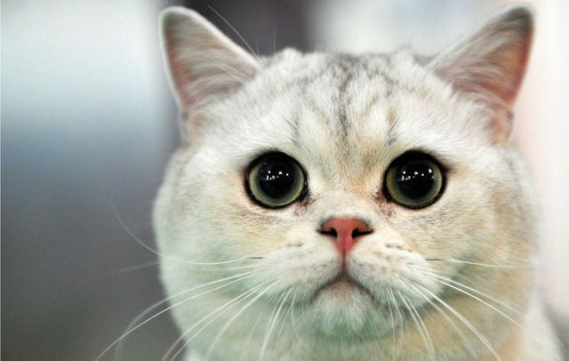
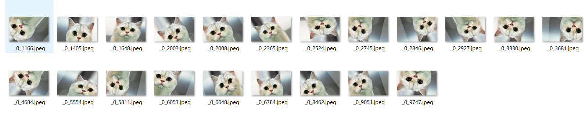

# python_image_enhancement
<strong> eng :</strong> We make 21 different images from a single image.  
<strong>tr : </strong>Tek görüntüden 21 farklı görüntü yapıyoruz. 
<strong>--> The image we use (Kullandığımız görüntü) </strong>
</img> 
<strong>--> Enhanced images(Artırılmış görüntüler) </strong>
</img> 
